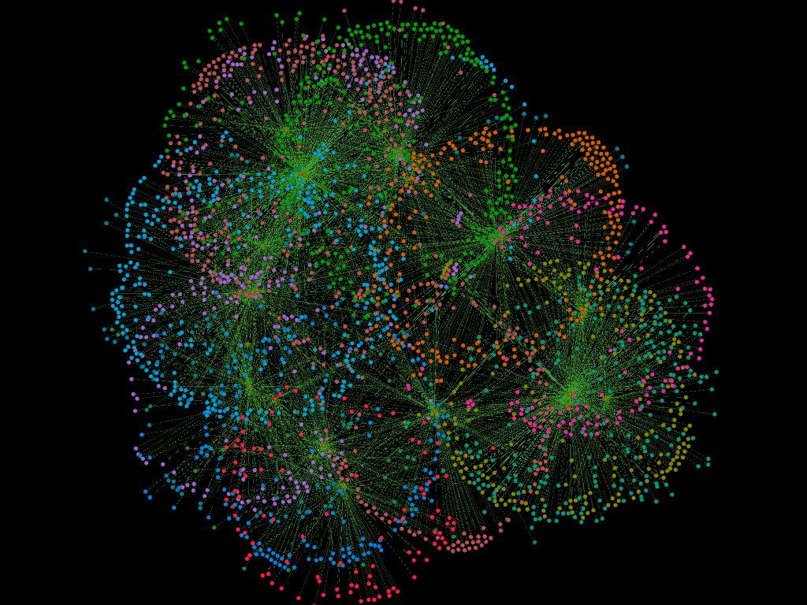

<!-- Edit the `index.md` file to change this content. All pages on the blog, including this one, use [Markdown](https://guides.github.com/features/mastering-markdown/). You can include images:
 -->

I stumbled on this very neat guide to blogging here: https://www.fast.ai.  The picture above?  That is what behaviour looks like, in HD and 2D.  Those dots are __people__ transaction at __merchants__.  Now you're no longer a number, you're a dot!
